# Дизайн и состояние партии

## Цель

Игроки совместно сохраняют укрытие и выбирают ограниченный состав жителей. Успех складывается из двух независимых оценок: выживание группы и персональная скрытая цель. Отсутствие места внутри не является автоматической смертью: исключённые образуют наружный лагерь с неизвестной дальнейшей судьбой.

Скрытая цель оценивается только для пережившего финал жителя. Никакая карточка не добавляет голоса, не отменяет исключение и не даёт право читать чужие данные. Параметры здоровья, пола и возраста не являются числовым рейтингом человека.

## State machine

```mermaid
stateDiagram-v2
    [*] --> lobby
    lobby --> story: 4–16 готовы; старт
    story --> story: акт 1 → 2
    story --> reveal: акт 3
    reveal --> reveal: следующий активный
    reveal --> event: все раскрылись
    event --> discuss: выбор и проверка
    discuss --> vote: нужны исключения
    discuss --> reveal: следующий акт
    vote --> defense: первая ничья
    defense --> vote: повтор
    vote --> vote: ещё одно место
    vote --> reveal: следующий акт
    vote --> final: акт 9
    discuss --> final: акт 9
    final --> finished: выживание и эпилог
    finished --> [*]
```

История актов: «Последний обычный день», «Сирены над городом», «Первое раскрытие», «Амур молчит», «Огни Хэйхэ», «Первая ночь», «Раскол», «Последнее голосование», «Дверь закрывается», «После Бункера».

Из любой незавершённой фазы можно выйти. Если все ушли — `finished` без проверки. Администратор также может закрыть комнату. Смертей и неожиданных исключений вне итогового выживания, добровольного ухода, блокировки и голосования нет.

## Агрегат Room (schema 1)

- `code`, `host`, `chat_id`, `created_at`, `packs`, `max_players`;
- `phase`, `act`, `epoch`, абсолютный `deadline`, режим `timer`;
- `players`: Telegram ID → имя, статус, контактность, досье, раскрытые поля, связи, цель и особое условие;
- `resources`: шесть целочисленных шкал 0–100;
- `catastrophe`: выбранная катастрофа со всеми стадиями, видимыми только через публичную проекцию;
- `features`: три разные характеристики укрытия с начальными бонусами;
- `turn`, `queue`, `done`: порядок раскрытия и завершённые ходы;
- `choices`, `votes`: закрытые ответы текущей фазы; не входят в публичную проекцию до закрытия;
- `runoff`, `vote_round`: список кандидатов при ничьей и номер попытки;
- `initial`, `capacity`, `removed`: размер партии, места, число проголосованных исключений;
- `seed`, `roll`: сохранённая последовательность псевдослучайных бросков;
- `events_used`, `history`, `ending`, `epilogue`.

Случайность пригодна для дружеской настольной игры, не для азартных игр на деньги и не является проверяемым криптографическим жребием. Состояние не выдаётся клиентам целиком.

## Раскрытие

Владелец с начала видит своё досье, включая направленные отношения и цель. Для остальных пол/возраст открыты; дальнейшее раскрытие — одна карточка на персональный ход. Поздние ворота: биография/страх/достижение с 4, мораль с 5, отношения с 6, секрет с 7. Всего шесть добровольных раскрытий; всё досье автоматически к финалу не становится общим.

При истечении срока бот выбирает первое доступное несекретное поле; ни связь, ни секрет не раскрываются автоматически. Моральный поступок и биография считаются обычными доступными поздними полями. Каждый публичный факт попадает в историю, поэтому не теряется при замене панели.

Связи выдаются по направленному циклу игроков, чтобы каждый знал хотя бы одну. У взаимного типа создаётся обратная запись. Каждый участник видит только исходящие записи; наличие входящей односторонней записи ему не сообщается. Цель связывается с конкретным другим участником; смена имени не меняет ID цели.

## Сцены

Пакет содержит 100 основных сцен и одну дополнительную. За партию играются шесть разных. В нечётных актах при наличии подходящих публичных тегов выбирается релевантная сцена; в чётных — случайная из всех неиспользованных. Так сильные навыки получают применение, но не гарантируют удобную катастрофу.

Группа выбирает один из двух вариантов тайно в ЛС. Больше голосов за первый — действие с проверкой; равенство и отсутствие ответов означают второй, консервативный план. Неизменяемый голос делает последствия понятными. Итоги выбора после закрытия публикуются численно.

Активный персонаж даёт +2, если хотя бы одна **раскрытая** характеристика содержит подходящий тег сцены. Суммарный бонус ограничен +3; один человек с несколькими совпадающими карточками не считается несколько раз. `d6 + бонус >= 5` — успех. Например, открытое знание китайского помогает понять сообщение из Хэйхэ; скрытый переводчик без открытой профессии не даёт бонуса. Исключённые не помогают ресурсными тегами.

Базовые сцены: успех +8 основного ресурса, провал −9, осторожный план −3. В дополнительной сцене и новых пакетах эффекты могут отличаться. Шкалы ограничены 0–100. Дополнительная подсказка показывается, только если раскрыт релевантный опыт.

## Голосование и уход

Только `status=active`, строго один голос от Telegram ID; за себя нельзя. Итоги до закрытия не публикуются. При первом равенстве — право защиты всех лидеров; затем те же активные голосуют только между ними. При повторном равенстве выбирается один аварийный жетон.

Выход удаляет голос уходящего, ответы на событие и голоса за него. План исключений учитывает этот уход. Если нужное число мест уже освободилось, голосование закрывается без дополнительного исключения. Если в переголосовании остаётся один кандидат, он определяется без требования голосовать за самого себя. Кандидатов больше нет — новое обычное голосование, если ещё требуются места.

Без таймера все активные участники должны завершать действия. Пользователь, который просто свернул Telegram, не объявляется покинувшим автоматически. Уход из группы или постоянный запрет доставки в ЛС — явные признаки недоступности. Возвращение восстанавливает просмотр, но не голос и не место.

## Финал

Давление катастрофы уменьшает один ресурс на 12. Затем:

`score = среднее шести ресурсов + min(12, 2 × число разных раскрытых тегов) + d20 − 10`

Если хотя бы один ресурс равен нулю, дополнительно −20. От 65 — «Новый берег», от 40 — «Трудная весна», ниже — «Исход». В первых двух выживают все оставшиеся жители. В «Исходе» каждому оставшемуся нужен d6 >= 3; неудача описывается как исчезновение в экспедиции. Это абстрактная игровая модель, не расчёт реального выживания.

Эпилог сохраняет день выхода, последнюю стадию катастрофы, финальную проверку, судьбу каждого игрока, принятые решения и связь с другим берегом при наличии открытого опыта. Он повторяем после перезапуска, публикуется в группе и доступен по кнопке. Цели и нераскрытые секреты автоматически в эпилог не попадают.

## Сохранение и развитие

Движок принимает словарь, действие, актор, аргумент, epoch и время; не импортирует Telegram или SQLite. Service применяет действие в транзакции репозитория, сохраняет агрегат и outbox. Внешняя отправка выполняется после коммита.

Для PostgreSQL: реализовать интерфейс Repository, транзакционную блокировку комнаты (`SELECT FOR UPDATE`), уникальность ключей обработанных обновлений, outbox с блокировкой захвата, миграцию JSON-агрегатов и стратегии ACK. При многопроцессной работе заменить long polling на webhook, предусмотреть lock/lease для таймеров. Это план расширения, а не уже реализованный PostgreSQL backend.

Лимит игроков вынесен в агрегат и аргумент создания. Для увеличения кроме изменения значения нужны проверка размера мобильных клавиатур, времени очереди, интенсивности сообщений и баланса. Первичная поставка поддерживает и тестирует только 4–16.
